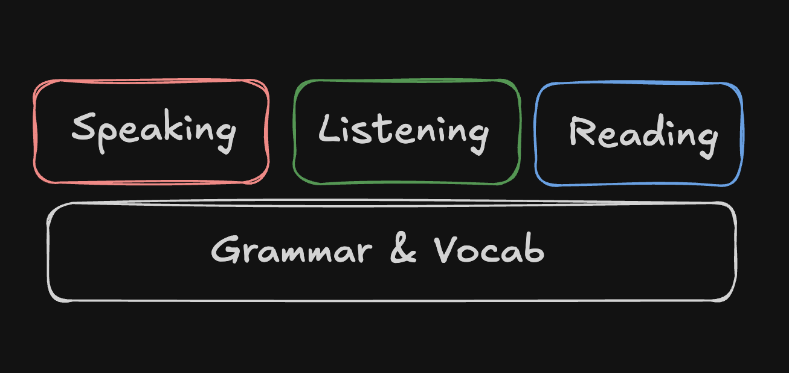

> the student is confused. "Why does it keep taking longer the harder I say I'll work?"
> the master answers, "Because with one eye fixed on the destination, you only have one eye left to find the way."

## opening

hey! so i've been learning japanese for awhile now. 

wait lemme check how long. still checking. just one sec. July 8th, it's Sep 14th. wow! only a little over 2 months.

wait that's actually crazy. so it hasn't really been awhile. it's really only been a short time.

i feel like i've made a lot of progress in 2 months tho. i'm genuinely amazed.

anyway, this whole process has genuinely be wonderful. i wanted to share it here. my mindset. my process. my learning stack.

## make it fun

i think when i do my active recalls with Bunpro, or when i have classes with my teacher (more on that later), i genuinely look forward to them. in fact, after a long day, i WANT to learn more. it's like my way of unwinding now. 

i think this is important, because learning a language is a multi year process. if you don't enjoy it, you'll feel it by about month 3 

to draw from my own experience in the gym. 

there was a moment i actually felt *strong* in the gym. it wasn't something that i saw coming. there wasn't a 'final sprint' until i finally become strong. it wasn't like 'OH MY GOSH IM FINALLY STRONG'

i just found myself lifting really heavy one day. maxing out machines. doing more weight than those around me. 

and then i thought to myself 'woah im actually pretty strong'

## how the pieces fit

this is prolly all the pieces to learn japanese

grammar + vocab = the foundation 
speaking / listening / reading = built on top of grammar & vocab

## grammar & vocab

my stack:

- Hiragana - [Learn Hiragana: The Ultimate Guide](https://www.tofugu.com/japanese/learn-hiragana/)
- Katakana - [Learn Katakana: The Ultimate Guide](https://www.tofugu.com/japanese/learn-katakana/)
- Grammar & Vocab - [Bunpro](https://bunpro.jp/)

ok yea no one really struggles with grammar & vocab imo. 

get your hiragana and katakana down (took me a week but you could do it in 3 days if you locked in)

then pick a spaced repetition system. i like bunpro because i feel it's comprehensive and they gamify it well. they also have jlpt practice tests which is cool. i know some people don't like daily streaks, but i kinda like the pressure!

## speaking

my stack:

- Speaking - [Preply](https://preply.com/)

i think like if you are not in an environment where you get opportunities to speak Japanese, you will be in trouble.

you gotta speak it man. 

think about how you learn your first language (english in my case). like, as babies, the way we learn is that, we have feelings and we see things, and we're just looking for words to express that. how did i learn the word 'happy'? i learned that when i laugh, when i feel good, when i smile, that's 'happy'. how did i learn the word 'fire'? that red hot glowy thing. that's fire. 

compare that to how we learn formally. 
happy - feeling, showing, or causing pleasure or satisfaction
fire - the active state of burning that produces heat, light, and flames

it's just words. they don't connect. 

i think that's when working with a coach helps so much. I have a preply coach that I meet twice a week for fifty minutes each time, and like this coach is like absolutely amazing, right? Like genuinely she makes it so easy to learn, and it's fun because it feels so good just to like actually speak the language.

i think there are online solutions for this like im sure you could use AI as a conversation partner or something. 

but i think that should be supplementary. don't make it the main course man.

language is all about human connection! it's all about understanding another human being. 

so yea, while speaking can be uncomfortable, it's also the most rewarding.

alternatives:

- another coaching site - [italki](https://www.italki.com/)
- language exchange - [Meetup](https://www.meetup.com/)

## listening

my stack:

- Listening - [The Miku Real Japanese Podcast](https://www.mikurealjapanese.com/)

listening is like a background engine that passively boosts your japanese. 

you could do podcasts, animes, songs, and prolly more i cant think of rn.

ah problem is, for me my vocab is like not broad enough to implement this yet 

when i listen to immersion podcasts (immersion podcasts are these podcasts where they speak on any topic, but they speak slow simple japanese so you can understand), i can only understand 5-10% of the podcast unfortunately 😪

which is lowkey frustrating, but imma not rush the process. i think i just gotta keep learning doing bunpro step by step. and one day, i'll be watching anime with no subtitles.

## reading

my stack:

- dont have one

i deliberately am not focusing on reading. 

because:
- i do know mandarin, so that's an unfair advantage 
- it's not important to me. i'll be ok with it if i struggle a bit with reading 

i just think that reading is the lowest priroity. i mean like we learn so that we can, idk, just go to japan and talk to people, or watch anime without subtitles. 

i think it's not important.

there's a pretty famous stack for this though: yomitan + asbplayer

yomitan is a browser extension that will bring up definitions for japanese words as you hover your mouse over them.

asbplayer is also a browser extension. you download subtitles for a show, and then display it on whatever you're streaming on (Netflix, Crunchyroll, etc). and then you can use yomitan to hover over those subtitles.

actually as im typing this, im realizing that the yomitan + asbplayer stack is a listening + reading stack when you use it for anime.

actually yea, i should prolly implement that stack.

you could also read ebooks, manga, articles, newspapers

alternatives:

- pop-up dictionary - [Yomitan](https://yomitan.wiki/)
- subtitles on streaming sites - [asbplayer](https://github.com/asbplayer/asbplayer)

## closing

i used to watch polyglot videos and think to myself "they have natural God-given talent".

well actually tbh when i think about it, a lot of them do have the unfair advantage of living in different countries growing up and they just naturally learn new languages and not everyone can do that.

BUT EVEN THEN

it's like

anyone can learn a new language. and it's not hard. it's actually really fun. if you do it right.

before i started, i would do mental equations of like 'ok if i need 10k hours to learn a new langauge, i just need to spend 2 hours a day, and then that's 5k days, ok wait that's really long, oh that's why they use podcasts, but wait since podcasts are more passive, do they really count towards the 10k hours the same way actively studying does, but what if...'

and now it's like

'this is fun'

