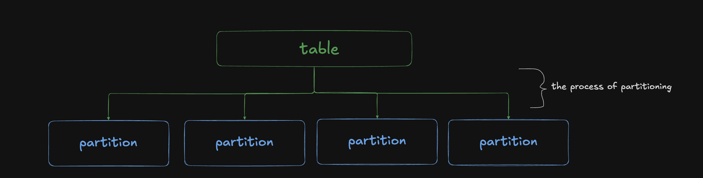
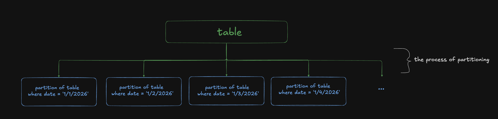

import HashPartitioning from '../../components/diagrams/HashPartitioning.astro';
import Correction from '../../components/Correction.astro';
import Definition from '../../components/Definition.astro';

## 1. brain dump

so partitions irl are those things that divide a room right? a divider, if you will

ok but see, in spark, a partition is not a divider. it's one of the divided pieces. 
it's not the *diviDER*, but the *diviDEE*! 😦 

AND, it's also the *action* of dividing. 

so, in spark, you *PARTITION* tables into *PARTITIONS*. 😭

ok, here's where my knowledge gets a lil fuzzy.

i know you can partition a table beforehand for performance gains. the most common case for this is a huge fact table with a date column.

| order_id | date       | customer_id | amount |
| -------- | ---------- | ----------- | ------ |
| 1001     | 1/1/2026   | c_042       | 25.00  |
| 1002     | 1/1/2026   | c_117       | 8.50   |
| 1003     | 1/2/2026   | c_042       | 112.00 |
| 1004     | 1/3/2026   | c_309       | 40.25  |
| 1005     | 1/4/2026   | c_117       | 17.75  |
| ...      | ...        | ...         | ...    |

if you decided to run `SELECT * FROM table`, it would be costly and slow. 
but, if you frequently query by date (e.g. `SELECT * FROM table WHERE date = '1/1/2026'`)
then you can partition the table by the date

this way, when you run `SELECT * FROM table WHERE date = '1/1/2026'`
instead of scanning the huge table and filtering the rows where `date = '1/1/2026'`
it grabs the partition where `date = '1/1/2026'` and returns that

ok, but idrk if that's a spark thing, or just a general query performance thing.
i think it's a general thing.

because when it comes to spark, the concept of partitions seems to often be brought up in conjunction with wide transformations, especially joins.

ok, so we know that Spark is distributed. so many machines are working together to produce the results.

imagine we wanted to perform a join between 2 tables (customers and sales will be our example). 

if we randomly partitioned our table and put them in each machine, how will they join? they can't.

<HashPartitioning random highlight={1} note="❌ customer 1 is in partition 1, but their sales are in partitions 0 and 2" />

so, we use a hashing function. we take each id from both tables, and run it through a hashing function that determines which partition they end up in. for example, `% 200` would do the job. 

<HashPartitioning highlight={1} note="all customers and their corresponding sales are within the same partition" />

btw, i'm using 200 partitions in the diagram because that's Spark's default. and it's easy to latch on to while understanding. and actually, with modern Spark, i think that number doesn't hold true anymore. there's a lot of dynamic stuff going on that can lower the number of partitions significantly.

now, every partition has all the rows that they need to perform the join. they do not need to grab rows from another table, which i dont even know if it's possible tbh.

this whole process is shuffling. i think. im not sure which part of the process is shuffling and which part is partitioning haha. 

## 2. fact check

**i said:**

> this whole process is shuffling. i think. im not sure which part of the process is shuffling and which part is partitioning haha.

<Correction>

Partitioning is deciding: working out which partition each row belongs to, using the hash and `% 200`. Shuffling is moving: getting each row to where its partition is processed. Every shuffle starts with a partitioning step.

In practice, each machine partitions its own rows and writes them to local disk, grouped by destination partition. Then the machines on the other side fetch the pieces they need.

</Correction>

**ok so:**

partitioning is deciding, and shuffling is moving. ahh. ok that clears things up a lot actually HAHAHA. so the hashing, the `% 200`, that's partitioning. you're deciding which partition the rows go to. shuffling is the actual moving of the rows to its partitions.

---

**i said:**

> they do not need to grab rows from another table, which i dont even know if it's possible tbh.

<Correction>

It's possible, and it's exactly what the shuffle is (you probably meant another machine rather than another table). Before the join, every machine sends each of its rows over the network to whichever machine will handle that row's partition. After that, like you said, each partition has everything it needs and the join happens locally. Moving rows across the network is the slow, expensive part, which is why people care so much about shuffles.

</Correction>

**ok so:**

grabbing rows from another machine is what shuffling is for. right. ok it's not that it's impossible, but it involves shuffling which we don't wanna do unnecessarily. that's why we wanna partition well.

---

**i said:**

> ok, but idrk if that's a spark thing, or just a general query performance thing.
> i think it's a general thing.

<Correction>

It's both. Splitting a table into one folder per date is a general idea (Hive, BigQuery and Postgres all do it), and Spark does it too, with `df.write.partitionBy("date")`. Skipping the folders a query doesn't need has a name: partition pruning.

But it's a different kind of partition from the one in the rest of this article. Spark uses the word for two things:

- **on disk:** how the files are laid out in storage, decided when the table is written. That's the date example.
- **in memory:** the chunks of rows Spark splits the data into while a job runs. Each chunk is processed by one task. That's the join example.

They're related, since reading a date folder produces some in-memory partitions, but they aren't the same thing. Mixing them up is where a lot of the fuzziness comes from.

</Correction>

**ok so:**

i see. the one folder per date thing is also partitioning. it's a form of partitioning! since you're making a decision on how to divide up the table.

Writing into folders on disk `/sales/date=2026-01-01/`, `/sales/date=2026-01-02/`, … . That's partitioning.

Running `WHERE date = '2026-01-01'` and having Spark read only that one folder and ignore the other 364. That's pruning

and many platforms do partition pruning. it's a common technique.

but the partitioning that i was describing is the partitioning spark does, and that all happens in memory, instead of on disk.

---

**i said:**

> if we randomly partitioned our table and put them in each machine, how will they join? they can't.

<Correction>

Spark doesn't partition randomly on purpose. When it reads a table, it cuts the files into chunks of about 128 MB. From the join's point of view that's as good as random, though, because nothing puts matching keys together.

Partitions also aren't one per machine. Each executor runs one task per CPU core at a time and works through many partitions, so 200 partitions on 10 machines is normal.

And "they can't" has one exception: if one of the tables is small, Spark copies the whole thing to every machine instead. That's the broadcast join from your joins article. Nothing has to line up then.

</Correction>

**ok so:**

it seems like whenever you do any kind of reading/editing to a table, by default, spark will 'randomly partition' to read the table. It cuts the files into chunks of about 128mb.

but, when joins are involved (or any wide transformation), that's when spark realizes that the partitions need to contain the same joining keys, and *shuffles* the partitions.

partitions aren't one per machine. ok, so i was conflating machines and partitions. those 2 things are separate. it's like if i have 10 machines and 200 partitions, then each machine will handle 20 partitions (on average).

---

**i said:**

> so, we use a hashing function. [...] for example, `% 200` would do the job.

<Correction>

`% 200` on its own isn't a hash function. It's the step after one. Spark first runs the key through a hash function (Murmur3), which turns any value, whether a number, a string or a date, into a number. Then it takes that number `% 200` to pick the partition.

The diagram skips the hash so the math is checkable, which is why 1 and 201 end up together. With the real hash they'd probably land in different partitions. What matters is that the same key always gives the same partition.

</Correction>

**ok so:**

`% 200` on its own isn't a hash function. ohh. ok. i actually thought `% 200` was just like an example to help learn hashing better. ok but it's actually something else.

Spark first runs the keys through a hashing function, which turns any value, whether a number, a string or a date, into a number.

Then, it takes that produced number and `% 200` it to pick the partition. Ok slight mental model readjustment.

---

**i said:**

> and actually, with modern Spark, i think that number doesn't hold true anymore. there's a lot of dynamic stuff going on that can lower the number of partitions significantly.

<Correction>

Right. The setting is `spark.sql.shuffle.partitions`, and it's still 200 by default. What changed is adaptive query execution (AQE), on by default since Spark 3.2. After a shuffle, it looks at how much data actually landed in each partition and merges the small ones, so you often end up with far fewer than 200.

</Correction>

**ok so:**

the dynamic stuff is mostly AQE. gotcha.

## 3. rewrite

so partitions irl are those things that divide a room right? a divider, if you will

ok but see, in spark, a partition is not a divider. it's one of the divided pieces. 
it's not the *diviDER*, but the *diviDEE*! 😦 

AND, it's also the *action* of dividing. 

so, in spark, you *PARTITION* tables into *PARTITIONS*. 😭

first, let's talk about partitioning on disk.

you can partition a table beforehand for performance gains. the most common case for this is a huge fact table with a date column.

| order_id | date       | customer_id | amount |
| -------- | ---------- | ----------- | ------ |
| 1001     | 2026-01-01 | c_042       | 25.00  |
| 1002     | 2026-01-01 | c_117       | 8.50   |
| 1003     | 2026-01-02 | c_042       | 112.00 |
| 1004     | 2026-01-03 | c_309       | 40.25  |
| 1005     | 2026-01-04 | c_117       | 17.75  |
| ...      | ...        | ...         | ...    |

if you decided to run `SELECT * FROM table`, it would be costly and slow. 
but, if you frequently query by date (e.g. `SELECT * FROM table WHERE date = '2026-01-01'`)
you can partition the table by the date

these partitions are stored on disk
`/sales/date=2026-01-01/`, `/sales/date=2026-01-02/`, ...

this way, when you run `SELECT * FROM table WHERE date = '2026-01-01'`
instead of scanning the huge table and filtering the rows where `date = '2026-01-01'`
it *prunes* all the other partitions, and only grabs the partition where `date = '2026-01-01'`

now, let's talk about partitioning in memory.

ok, so we know that Spark is distributed. so many machines are working together to produce the results.

imagine we wanted to perform a join between 2 tables (customers and sales will be our example). 

first, spark will take the table and partition it into 128 MB partitions and distribute it to the machines. basically, it partitions by random. this is required to read the table. it can't partition by a key it doesn't know about yet. 

but now, looking at the diagram below, we see that the rows that need to be joined are scattered across partitions.

<HashPartitioning random highlight={1} note="customer 1 is in partition 1, but their sales are in partitions 0 and 2" />

in order to perform the join, spark will need to *shuffle* rows between partitions, so that matching ids end up in the same partition.

<Definition term="partitioning">

the process of deciding which partition each row belongs to

</Definition>

<Definition term="shuffling">

the physical moving of rows between partitions.

</Definition>

so, we shuffle it once. 

first, we use a hashing function. this will take all the ids, whatever form they come in (numeric, string, date), and return a numeric value. 

then we take that numeric value and do `% 200` on it to determine which partition they end up in. this way, all the same ids from customer and sales will end up in the same partition. 

then, the shuffling happens.

<HashPartitioning highlight={1} note="all customers and their corresponding sales are within the same partition" />

btw, i'm using 200 partitions in the diagram because that's Spark's default. with modern Spark, the number of partitions is more dynamic and often lower than 200 due to Adaptive Query Execution (AQE). don't worry about it. just know it exists.

now, every partition has all the rows that they need to perform the join. they do not need to grab rows from another partition.

